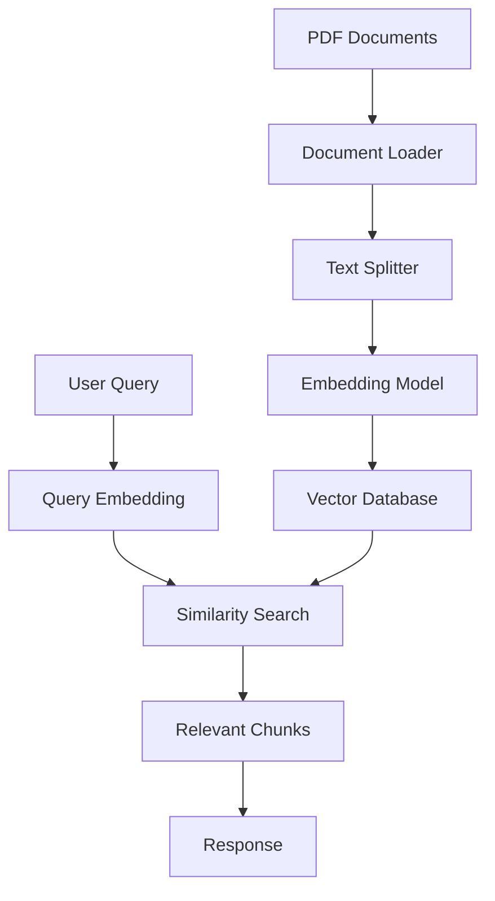

# 📄 Ask-PDF: Intelligent PDF Question Answering System 🤖

> *An elegant solution for extracting insights from PDF documents through natural language queries*


## 🎯 Purpose

Ask-PDF transforms how you interact with PDF documents by allowing you to ask questions and receive contextually relevant answers. Built with modern vector search technology, this tool eliminates the need to manually scan through lengthy documents.

## ✨ Key Features

| Feature | Description |
|---------|-------------|
| 🔍 **Semantic Search** | Goes beyond keyword matching to understand the meaning behind your questions |
| 🧩 **Document Chunking** | Intelligently splits documents for more accurate context retrieval |
| 💾 **Vector Storage** | Uses FAISS for efficient similarity search and retrieval |
| 🔄 **Persistent Index** | Save and reload document embeddings for future use |
| 📚 **Multiple PDFs** | Process and query multiple PDF documents simultaneously |

## 🛠️ Technology Stack



## 📋 Requirements

- Python 3.10+
- LangChain ecosystem
- Sentence Transformers
- FAISS vector database
- PyPDF for document parsing

## 🚀 Getting Started

### Installation

```bash
# Clone the repository
git clone https://github.com/Yash-Kavaiya/ask-pdf.git
cd ask-pdf

# Install dependencies
pip install -r requirement.txt
```

### Quick Usage

1. **Place your PDF documents** in the project directory
2. **Run the Jupyter notebook**:
   ```bash
   jupyter notebook askpdf.ipynb
   ```
3. **Update the file path** to point to your PDF document
4. **Execute the cells** to process the document and create embeddings
5. **Ask questions** by modifying the query variable

## 💡 Example Usage

```python
# Load and process your PDF
loader = PyPDFLoader("your_document.pdf")
pages = loader.load_and_split()

# Create embeddings and store in FAISS
embeddings = HuggingFaceEmbeddings()
db = FAISS.from_documents(texts, embeddings)

# Ask questions
query = "What is the main conclusion of the document?"
docs = db.similarity_search(query)
print(docs[0].page_content)
```

## 📊 How It Works

1. **Document Processing**: PDF files are loaded and split into manageable chunks.
2. **Embedding Generation**: Each chunk is converted into a vector embedding using a pre-trained model.
3. **Vector Storage**: Embeddings are stored in a FAISS index for efficient retrieval.
4. **Query Processing**: User questions are converted to the same vector space.
5. **Similarity Search**: The system finds chunks most similar to the question.
6. **Response Delivery**: Relevant document sections are returned as answers.

## 🔍 Advanced Usage

### Customizing Chunk Size

```python
text_splitter = RecursiveCharacterTextSplitter(
    chunk_size=500,  # Smaller chunks for more precise context
    chunk_overlap=50  # Overlap to maintain context between chunks
)
```

### Persisting Document Index

```python
# Save index for future use
db.save_local("faiss_index")

# Load existing index
new_db = FAISS.load_local("faiss_index", embeddings, allow_dangerous_deserialization=True)
```

## 📝 License

This project is available under the MIT License.

## 🤝 Contributing

Contributions, issues, and feature requests are welcome! Feel free to check [issues page](https://github.com/Yash-Kavaiya/ask-pdf/issues).

---

<p align="center">
  <i>Built with ❤️ by <a href="https://github.com/Yash-Kavaiya">Yash Kavaiya</a></i>
</p>
